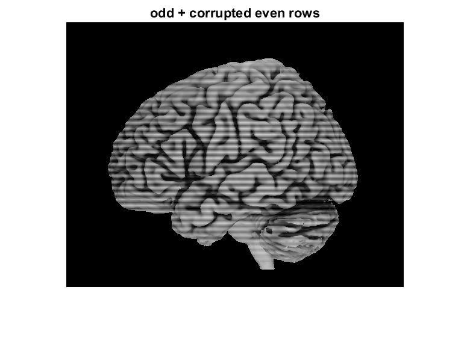
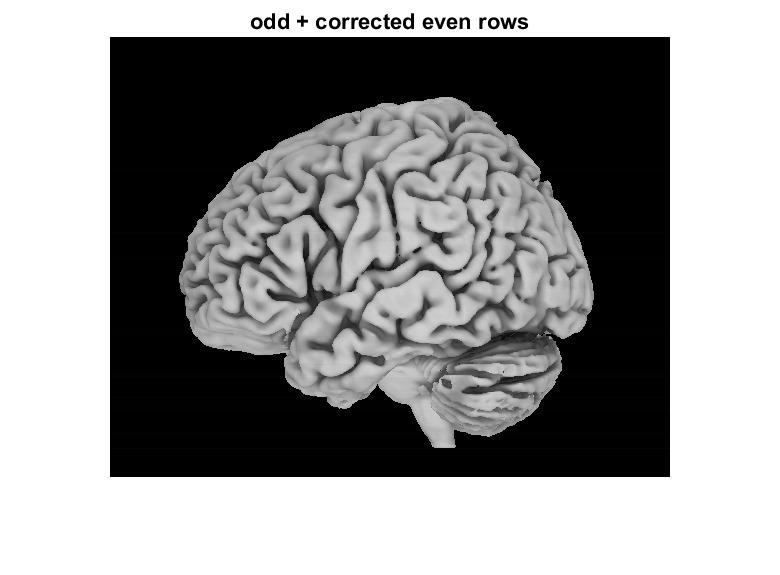

# Stitching images

Basic splicing 2 images together. One image was corrupted and needed to be fixed before combining into the final image.
Arbirary corruption can be corrected by using mean values of the odd rows and adding them to the adjacent even row.

## Images

