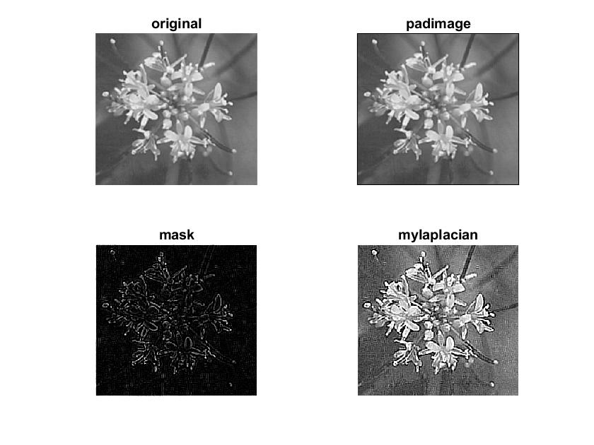

# Laplacian filter and Unsharp filter

Laplacian filter is a 2nd order spatial derivative filter, this uses an 8 directional filter.
The laplacian of an image highlights regions of rapid intensity changes and is often used for edge detection. 
It is better than 1st order derivative filters at detection changes, however, it is more sensitive to noise and produces double lines.

Unsharp filter is a sharpening operator (opposite of bluring).\
mask image: g(x,y) \
input image: f(x,y) \
gain, scaling constant: k \
g(x,y) = f(x,y) - blur(x,y) \
output(x,y) = f(x,y) + k * g(x,y)

## Images

