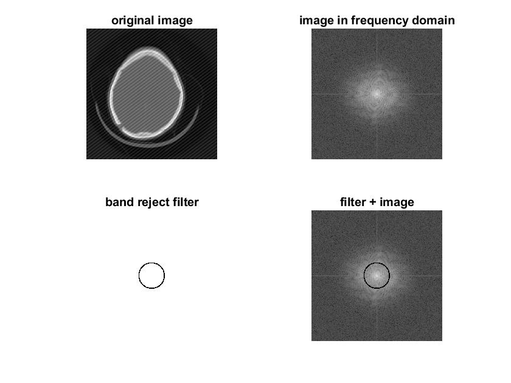
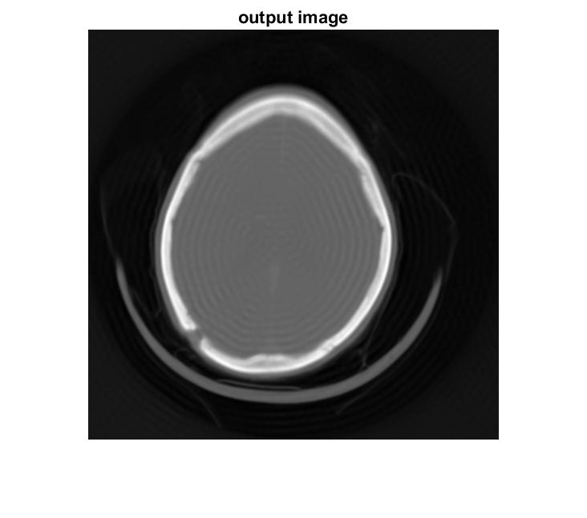
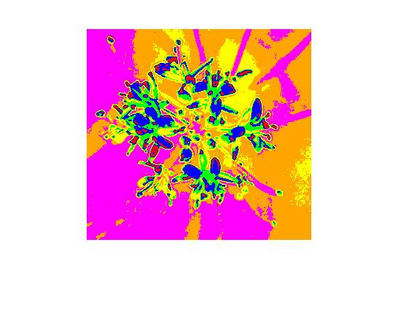
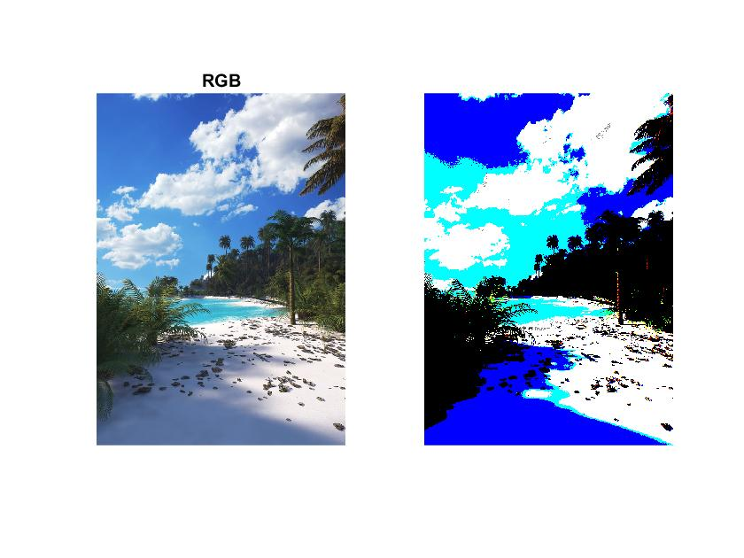
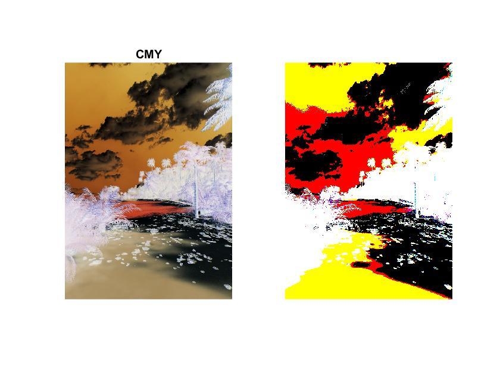
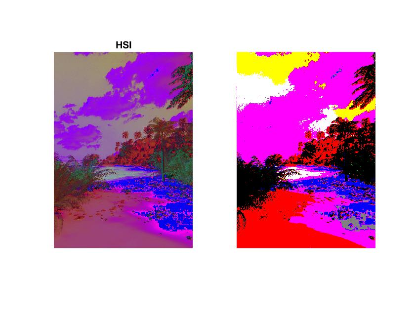

# Fast Fourier Transform, Pseudocolor, and Color Segmentation

An input image has an interference pattern of unknown spatial frequency orientation and magnitude.
Using FFT and a band reject filter, I reduced the interference frequency to improve the signals before reverse FFT to get the improved image.

myPseudocolor function takes in a binary image and using 8 bins to represent the 255 graylevels before assigning an arbirary color to each bin.
The color ranges from highest to lowest: [red, blue, green, yellow, orange, purple, brown, black].

myColorSegmentation takes in a RGB image and using 8 bins to classify the entire color space and assigning the closest primary and secondary color to each bin.
Next, the same process is done with CMY and HSI color spaces.

## Images

