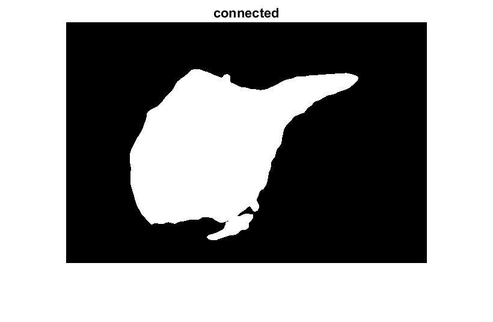

# Otsu's algorithm and Contour Extraction

My script want to highlight the forground(lake) from the rest of the image.
It takes in a color image and starts by using the blue channel, lake is blue, and applying a guassian blur to reduce sharp changes in intensity.\
Next, it goes into Otsu's algorithm which calculated the variances and optimally picks the threshold to separate the foreground and background. The foreground is represented as white and the background is represented as black.
The guassian blur removes a lot of the trees that would have appeared as the foreground.\
Next, I used extraction of connected components to find the entire lake out of a few foreground shapes.
I assumed the lake is in the center of the foreground and the algorithm works by dilation of the center pixel until it matches the entire lake.\
Next, I did boundary extraction by erosioning the lake and subtracting from the lake itself.
Lastly, I took the RGB image and overlay the white lake boundary on top.

## Images

