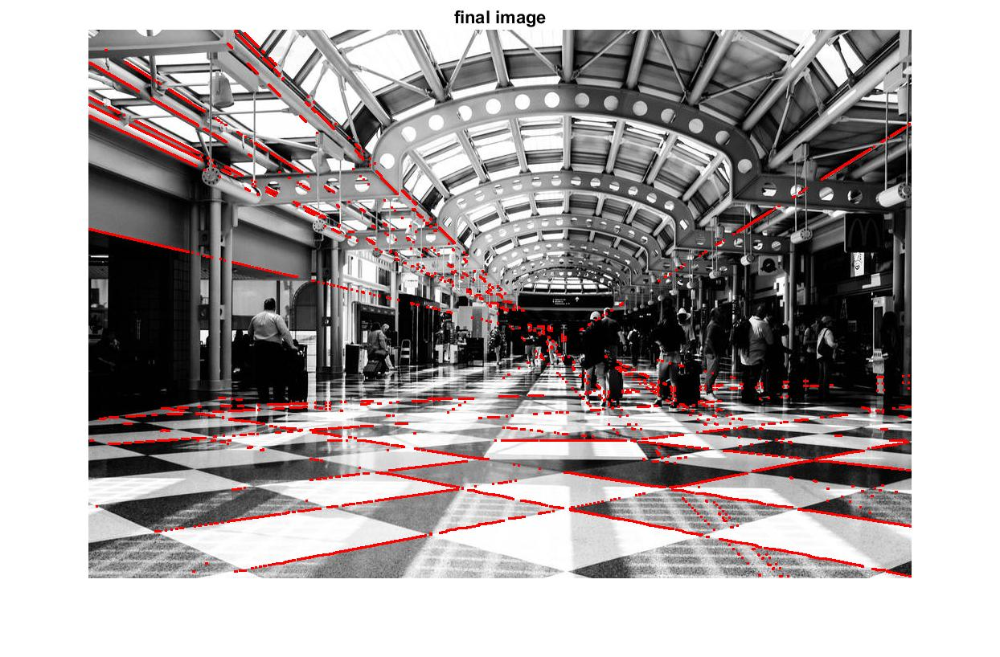

# Line, Circle, and Corner Detection
Hough transform is a feature extraction to find instances of objects within a certain class of shapes by a voting procedure.
This voting procedure is carried out in a parameter space for example:\
Lines equation is y=mx+b where m is the slope and b is the y intercept\
For each possibilities of x,y you get a corresponding a,b parameter pair.
However, m,b cannot handle vertical lines with m = infinite; so we use polar coordinates with theta and rho, where theta = angle from x axis and rho = perpendicular distance from origin to line.\
Circle equation is (x-a)^2 + (y-b)^2 = r^2 where a,b is circle's origin and r is radius.\
We use the parametric form of x = a + r*cos(theta) and y = b + r*sin(theta)
After the voting procedure, the parameters with the high vote is the correct parameter.
Using the original parameters, we can draw the lines/circles back out onto the images.

## Images

## Hough Transform Line
Simple demo of how line hough transform works.\
After trying every x,y cimbination, vote for each m,b or theta,rho corresponding combination.\
Each point in x,y space is a line in m,b space or a sinusoidial wave in theta,rho space.\
The parameter space with the highest vote is the correct one.\
Each point in m,b space and theta,rho space is a line in x,y space.\
With the correct parameter, we can draw the line back out in x,y space.

## Images

## Hough Transform Circle
Simple demo of how circle hough transform works for both known radius and unknown radius range.\
Same principle, the parameter space is a,b for 2D or a,b,r for 3D where a,b is the circle's center and r is the radius.

## Images

## Hough Transform Descriptor
Simple demo of how descriptor transform works.\ 
Using the equations: \
delta theta = thetaT - thetaQ where T is template and Q is query\
|xT| = | cos(Dtheta) -sin(Dtheta)| * |xQ| + |delta x| \
|yT|   |+sin(Dtheta)  cos(Dtheta)|   |yQ|   |delta y| \
Finds closest delta x,y,theta that will match the query image/data to the template image/data.\

## Images
