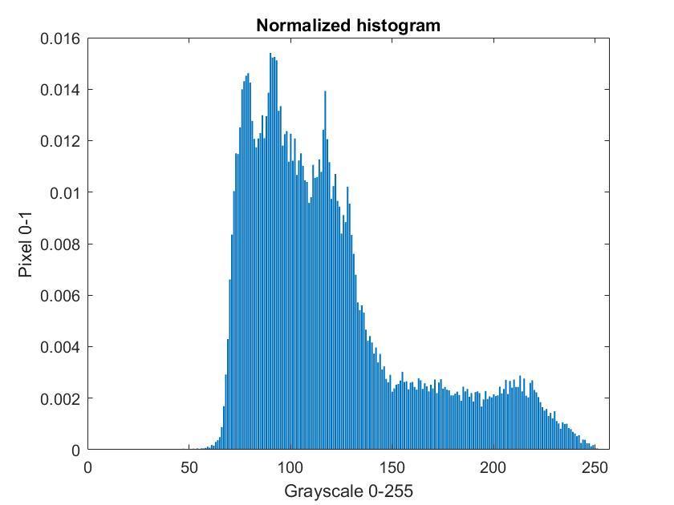
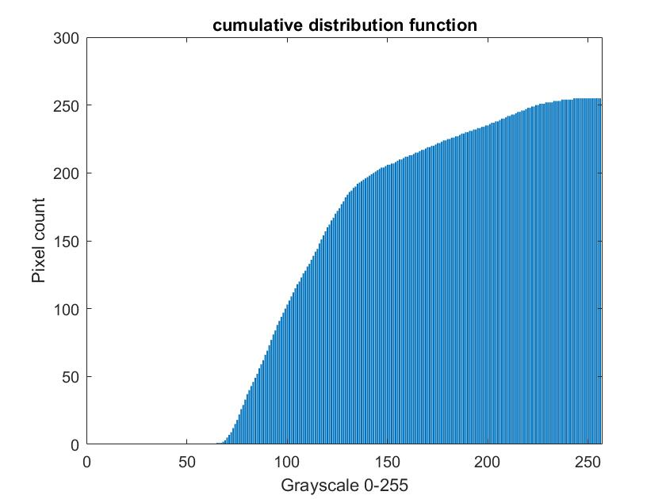
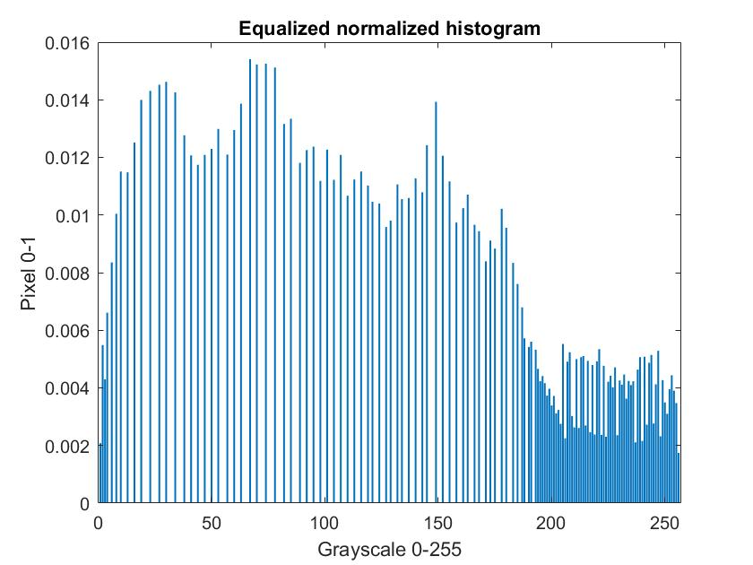
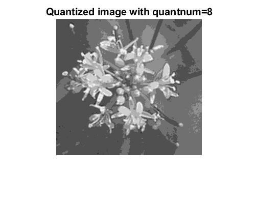
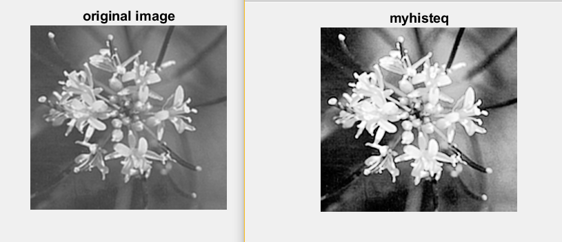
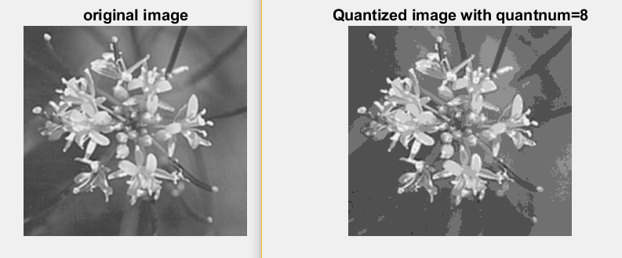

# Histogram, Histogram Equalization, Quantization

myhist function takes in a binary image and displays a normalized histogram.
myhisteq function takes in a binary image and displys a equalized and normalized histogram.
myquantize function takes in a binary image and uses less graylevels to display image.

## Images

